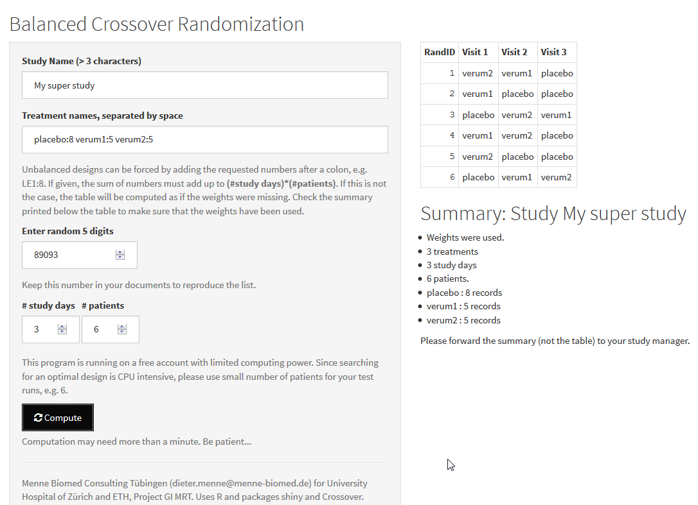

# Randomization of Crossover designs

dieter.menne@menne-biomed.de

GUI for simple balanced and unbalanced crossover design. Uses R-package `CrossOver` by  Kornelius Rohmeyer and Shiny.

## Example of call used internally:

```
searchCrossOverDesign(s=17, p=3, v=4, model="Self-adjacency model", eff.factor=c(1,0,0), contrast="Tukey", v.rep=c(17,15,11,8), balance.s=FALSE, balance.p=TRUE, random.subject=FALSE, n=c(1000,20), verbose=FALSE)
```

## Screenshot


